# PAMSI -> rok akademicki 2018/19 

Projekty :

|  Nr | Nazwa | Lokalizajca (folder) | Zawartość |
| :------------: | :------------: | :------------: | :------------: |
| 1  | Sortowanie  | /Sortowanie | Zawiera pliki nagłówkowe i źródłowe programu oraz plik Makefile w folderze o nazwie "Program" oraz sprawozdanie w formacie .pdf  |
| 2  | Grafy  | /Grafy | Zawiera pliki nagłówkowe i źródłowe programu oraz plik Makefile w folderze o nazwie "Program" oraz sprawozdanie w formacie .pdf  |
| 3  | Gra  | /Gra | Zawiera pliki nagłówkowe i źródłowe programu oraz plik Makefile w folderze o nazwie "Program" oraz sprawozdanie w formacie .pdf  |

# 1.Sortowanie 

Tabelka dla sortowania przez scalanie :

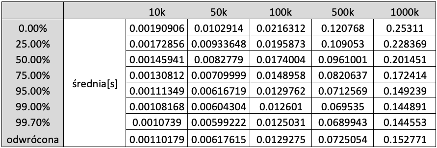 

Wykres dla sortowania przez scalanie :

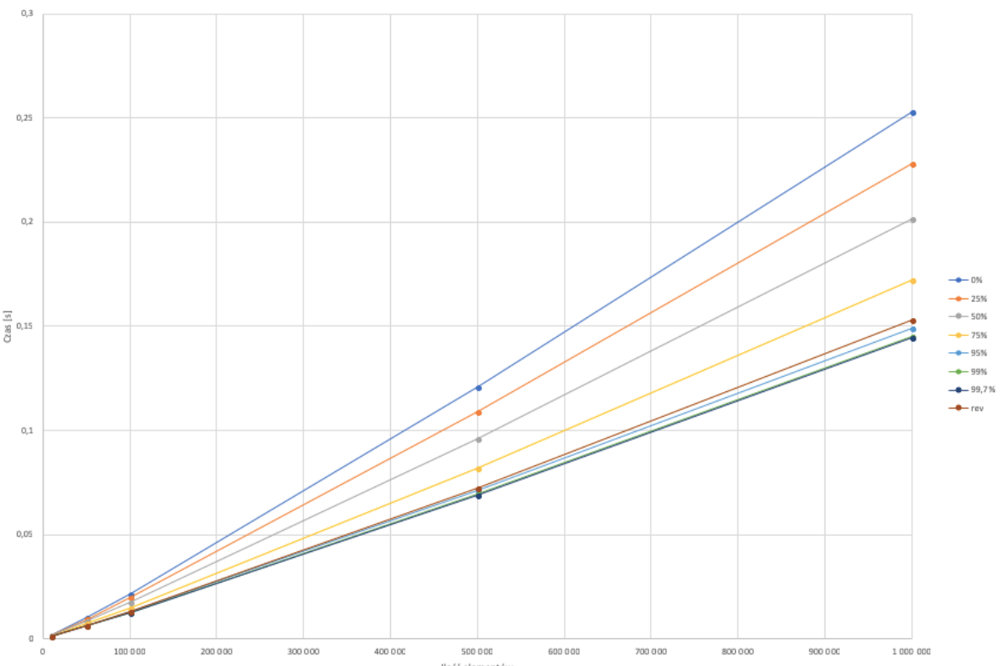 

Tabelka dla sortowania szybkiego :

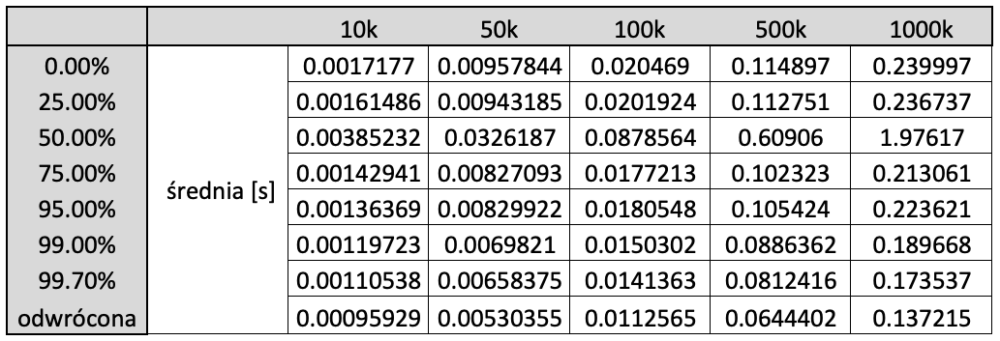 

Wykres dla sortowania szybkiego :

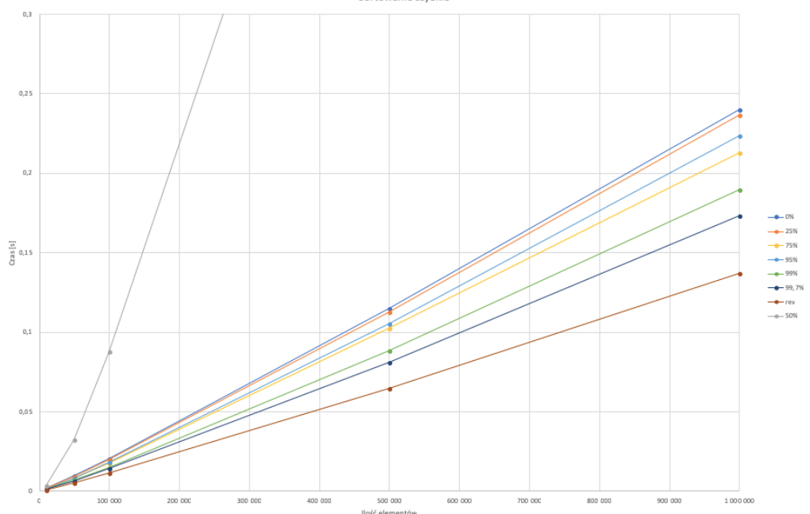 

Tabelka dla sortowania introspektywnego :

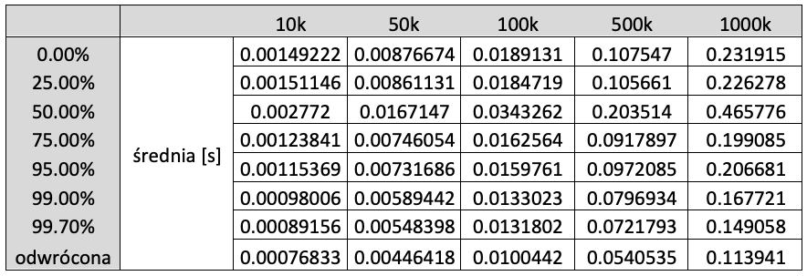 

Wykres dla sortowania introspektywnego :

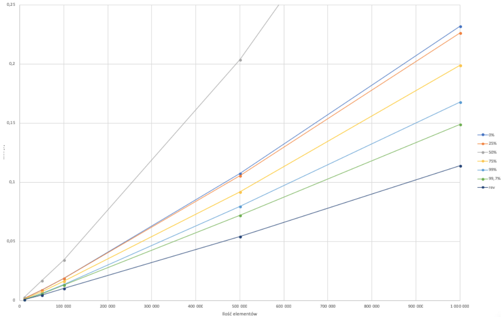 

# 2.Grafy 

Tabelki z czasem działania algorytmu Dijkstry dla reprezentacji grafu w postaci macierzy oraz listy sąsiedztwa :

a) macierz 

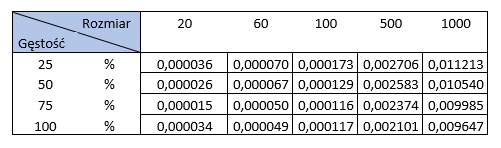 

b) lista 

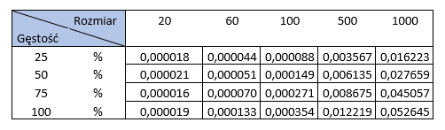 

Wykresy przedstawiające czas działania algorytmu Dijkstry dla reprezen-tacji grafu w postaci macierzy oraz listy sąsiedztwa dla różnych gęstościoraz rozmiarów grafu :

a) macierz 

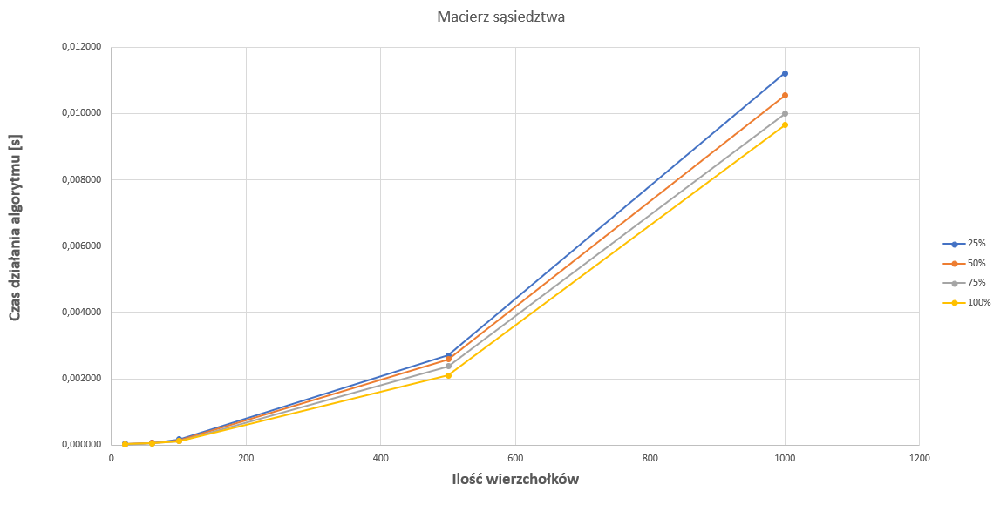 

b) lista

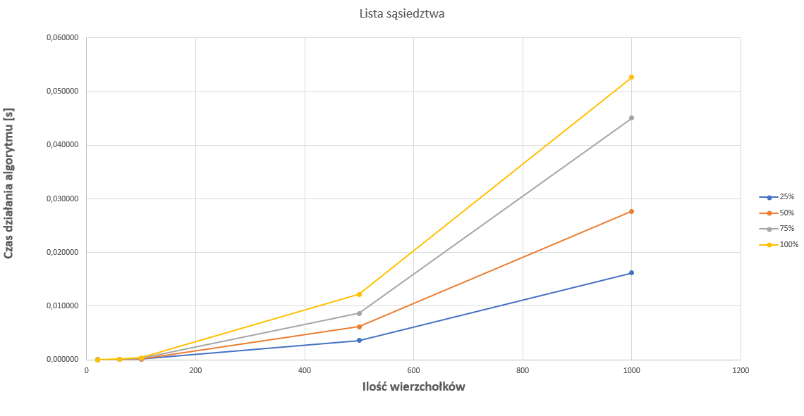 

# 3.Gra 

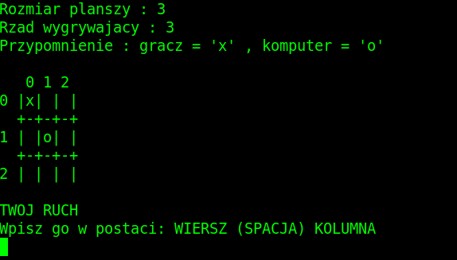 
